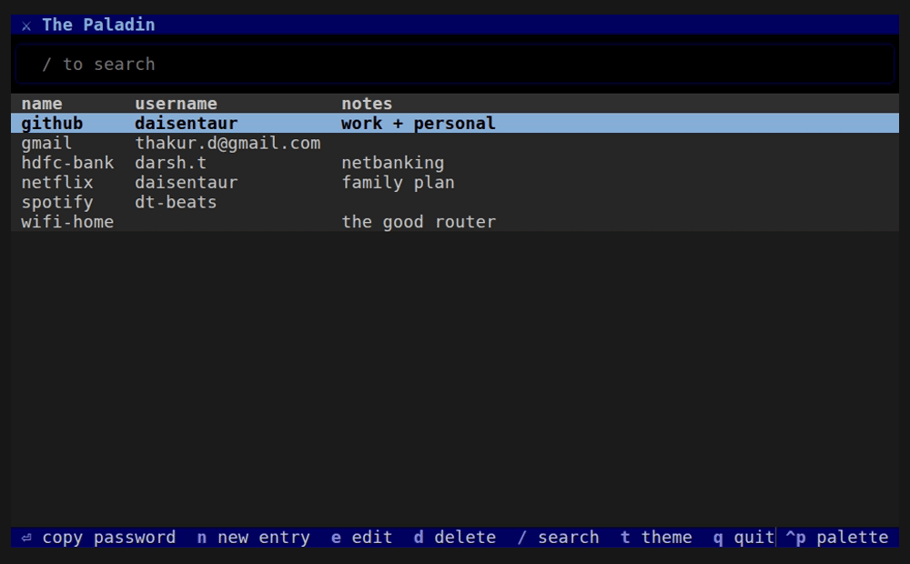
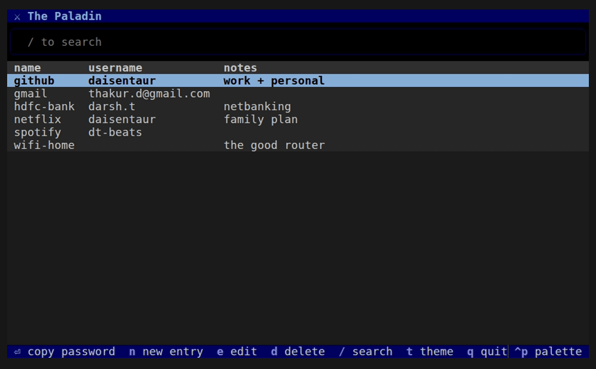
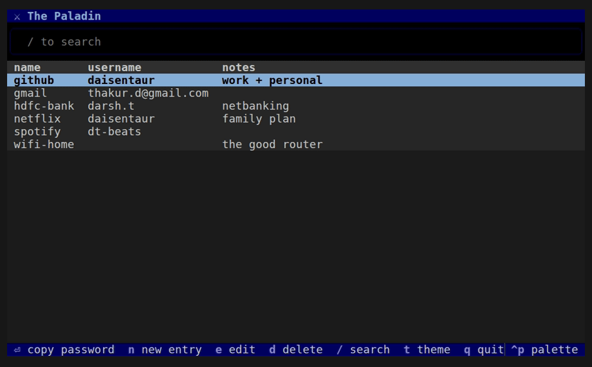

<p align="center">
  
</p>

<h1 align="center">The Paladin</h1>

<p align="center"><em>Your passwords, guarded locally. No browser, no cloud, just protection.</em></p>

A password manager that is one encrypted file on my own disk and a small
terminal app in front of it. No browser, no cloud, no daemon, no ai running 
in the background, no company holding my secrets. One file, one master password,
that's the whole thing.

(It installs as `basic-password-manager` because the name "The Paladin" came to me
quite a while after already starting the project. It answers to `paladin` as is its name)


## Install

From PyPI ([pipx](https://pipx.pypa.io) keeps CLI tools out of each other's business):

```bash
pipx install basic-password-manager    # or: pip install basic-password-manager
paladin init
```

From source:

```bash
git clone https://github.com/Daisentaur/password-manager && cd password-manager
pipx install .
```

Hacking on it: `python3 -m venv venv && ./venv/bin/pip install -e .`

## The TUI

Run `paladin` with nothing after it and you get the full app: unlock, arrow
around, Enter copies the selected password to your clipboard. `n` adds,
`e` edits, `d` deletes (it asks first), `q` quits. Every key is listed in
the bottom bar so there's nothing to memorize.

Press `/` and type whatever fragments you remember of whatever it is you're
looking for it just has to appear *somewhere* in the entry, any field, any
order. It even searches inside the passwords themselves, for the day all
you remember is what you typed on that site, so if it's in there the search 
will for sure find it. Matches get highlighted in the theme's accent, except
password matches, which quietly show the row and highlight nothing — passwords
never get displayed, that's the deal).



The rarer stuff lives in the command palette — `super+p`, commands you will need
sometimes but deffintely shouldn't crowd the main password list for example, 
importing your browser's passwords, opening your vault on your phone, and
changing the master password all live there, along with others.



And themes. `t` opens the theme picker; the bundled ones — muted-slate (default),
dawn, matrix — are lifted with love from
[tuxedo](https://github.com/webstonehq/tuxedo)'s palettes, and all of
Textual's built-ins are in there too. Your pick sticks across runs. Even the
knight on the unlock screen dresses to match your theme, try it ;)



## The CLI

Same vault, no interface, for when you just want the thing:

| Command | What it does |
|---|---|
| `paladin init` | create a new empty vault |
| `paladin add example` | store an entry (prompts for username/password/notes) |
| `paladin add example --gen` | same, but it invents a strong random password for you |
| `paladin get example` | copy the password to the clipboard, show the username |
| `paladin edit example` | update an entry field by field (Enter keeps what's there) |
| `paladin passwd` | change the master password |
| `paladin ls` | list entry names |
| `paladin rm example` | delete an entry |
| `paladin find "dt bank"` | search names, usernames, notes — every word must match, any order |
| `paladin gen -l 32` | just print a random password |
| `paladin import passwords.csv` | import a browser CSV export (see below) |
| `paladin mobile` | open your vault on your phone (QR + HTTPS tunnel) |
| `paladin about` | meet the knight |

The vault lives at `~/.local/share/pw-manager/vault`. Point the `PW_VAULT`
environment variable somewhere else if you disagree.

The `notes` field takes anything you want kept secret next to the password —
recovery codes, PINs, the answer to "what was your first pet".

### Leaving your browser's password manager

This is why the project exists, so here's the exit route:

1. Export:
   Chrome → `chrome://password-manager/settings` → "Export passwords".
   Firefox → `about:logins` → ⋯ menu → "Export passwords".
   Either way you get a CSV.
3. `paladin import passwords.csv` 
4. **Delete that CSV immediately** — it's every password you own, in
   plaintext: `shred -u passwords.csv`
5. Turn off password saving in the browser and delete what it stored.

## Your phone

`paladin mobile` (or "Open on phone" in the palette) puts your vault on your
phone with one QR scan. It spins up a throwaway HTTPS tunnel
([cloudflared](https://github.com/cloudflare/cloudflared), fetched
automatically the first time), serves a single page with the *encrypted*
vault baked in, and prints the URL as a QR in your terminal. Scan it, type
your master password **on the phone**, and the decryption happens in the
phone's browser — the laptop, the tunnel, and the network only ever carry
ciphertext. Nothing is stored on the phone; the page auto-locks after 5
minutes idle, and the whole session dies when you press Ctrl+C.

It works on any modern phone browser (Safari, Chrome, Firefox…) — no app to
install. The page opens in whatever TUI theme you had set when you generated
the QR, knight and all (it won't follow later theme changes — scan again for
that).

### Want it at your own subdomain?

By default every session gets a fresh random URL. If you own a domain and
want the QR to always point at *your* address instead, set one variable:

```bash
export PALADIN_MOBILE_URL=https://passwords.yourdomain.com   # in your ~/.bashrc
```

and point that subdomain at `127.0.0.1:8787` through whatever you already
use (reverse proxy, named tunnel — `PALADIN_MOBILE_PORT` changes the port).
From then on plain `paladin mobile` serves at your subdomain, every time, so
a phone bookmark keeps working.

To be clear about what this does and doesn't change: a session still only
lives while `paladin mobile` is running — closing it still ends access, and
the secret path at the end of the URL still expires every 30 days (your
bookmark needs refreshing then, on purpose). The only difference is that
every new session opens at *your* address instead of a random one.

The one thing crossing the internet is the encrypted blob, which is useless
without the master password that never leaves your phone. The tunnel provider
sees the same noise anyone else would.

## How it works

Three layers, pretty small. This project exists because I wanted to 
understand this stuff, I'd be happy if someone learns from this, from me:

### 1. `crypto.py` — password → key, key → ciphertext

An AES key must be 32 unpredictable bytes; your master password is neither.
**Argon2id** bridges the gap: `derive_key(password, salt)` always returns the
same 32 bytes for the same inputs — that's what makes unlocking possible at
all. It's deliberately slow and memory-hungry (64 MiB *per guess*), so
someone who steals the vault file can't brute-force short passwords on a GPU
the way they could against a plain hash. The pause when you unlock? That's
the lock being hard to pick. I've learned to love it.

The **salt** is 16 random bytes stored *unencrypted* in the vault file, and
that's fine — it's not a secret. Its whole job is making your derived key
unique so precomputed attack tables are useless. (This took me a while to
truly believe. It's fine. Smarter people than me checked.)

Encryption is **AES-256-GCM**, which is *authenticated*: decrypt with the
wrong key, or decrypt a file where even one bit was flipped, and it fails
loudly instead of handing back plausible garbage. Every encryption uses a
fresh random 12-byte **nonce** (also stored unencrypted, also not a secret).
The one iron rule of GCM: a (key, nonce) pair must never repeat — which is
why it's random every single time.

### 2. `vault.py` — the file format

```
[4 bytes "PWV1"][16-byte salt][12-byte nonce][ciphertext...]
```

The ciphertext is just your entries as JSON, encrypted. Load = read → derive
key → decrypt → `json.loads`. Save = the same backwards, with a fresh salt
and nonce, written to a temp file and atomically renamed so a crash
mid-write can't destroy the vault.

Your master password is stored nowhere. Not hashed, not hidden — nowhere.
"Wrong password" is just the decryption screaming, translated.

### 3. `cli.py` and `tui.py` — the interfaces

Both are thin skins over the two modules above. The TUI (built with
[Textual](https://textual.textualize.io)) holds the decrypted entries in
memory for the session; the CLI re-derives the key per command.

Passwords go to the clipboard (`wl-copy`/`xclip`/`xsel`, whichever exists)
rather than the screen, so they don't sit in your terminal scrollback. One
deliberate asymmetry: CLI `find` does *not* search passwords, because a CLI
argument lands in your shell history forever — the TUI search box does,
because nothing you type there is logged anywhere.

## Backups

Every save keeps the previous version as `vault.bak` next to the vault —
one-step undo for when a save goes wrong or you delete the wrong entry.

That covers mistakes, not the disk dying. For that: the vault is one file,
so copy it anywhere. Another disk, a USB stick, even somewhere you don't
trust — it's gibberish without the master password.

```bash
cp ~/.local/share/pw-manager/vault /some/backup/location/
```

### Moving to a new machine (or another OS)

The vault file plus the master password in your head is the *complete*
system — the salt lives inside the file, nothing belongs to the machine.
Install the package on the new system, drop your vault at
`~/.local/share/pw-manager/vault` (don't run `init` — that's for brand-new
vaults only), and everything works. Dual-booting? Park the vault on a
partition both systems mount and point both at it:
`export PW_VAULT=/mnt/shared/vault`.

## Troubleshooting

**"I forgot the master password."** The data is gone. Mathematically gone.
That's by design: every "forgot password?" flow is a back door, and back doors
don't check IDs. Pick a long phrase you can't forget (a sentence beats
`Tr0ub4dor&3`), and know that backups protect you from losing the *file*,
never from forgetting the *word*.

**"wrong master password (or the vault file is corrupted)"** — 99% of the
time you typo'd it. If you're *certain* it's right, the file got damaged;
restore the automatic backup
(`cp ~/.local/share/pw-manager/vault.bak ~/.local/share/pw-manager/vault`)
or an off-machine copy.

**Deleted or overwrote an entry by mistake** — the state before your last
save is sitting in `vault.bak`; restore it as above. One generation only,
so do it before the next save.

**"not a vault file (bad magic bytes)"** — whatever's at the vault path
isn't ours (truncated, overwritten, or wrong path). Check `echo $PW_VAULT`
and restore from a backup.

**"no vault at ..."** — run `paladin init`, or `PW_VAULT` points somewhere
unexpected.

**Password prints instead of copying** — no clipboard tool found. Install
one: `sudo apt install wl-clipboard` (Wayland) or `xclip` (X11).

**Unlock feels slow (~1s)** — that's Argon2 doing its job. The delay *is*
the brute-force resistance. Per command, not per keystroke.

**`MemoryError` from Argon2** — the key derivation wants 64 MiB free;
something is eating your RAM.

**Import brought in junk** — browser CSVs export everything, including
accounts from 2013. `paladin rm <name>` the corpses, or prune the CSV first.

## Honest limitations

I'd rather you know these than find them:

- No clipboard auto-clear yet: a copied password stays on the clipboard
  until you copy over it. Copy something else when you're done.
- While a command runs, decrypted data briefly exists in process memory.
  Malware already on your machine could read it — true of every password
  manager ever made; the vault protects the file at rest, not a compromised
  machine.
- Single file, no sync. Syncing is your problem for now.

## Running the checks

```bash
./venv/bin/python test_vault.py
```
